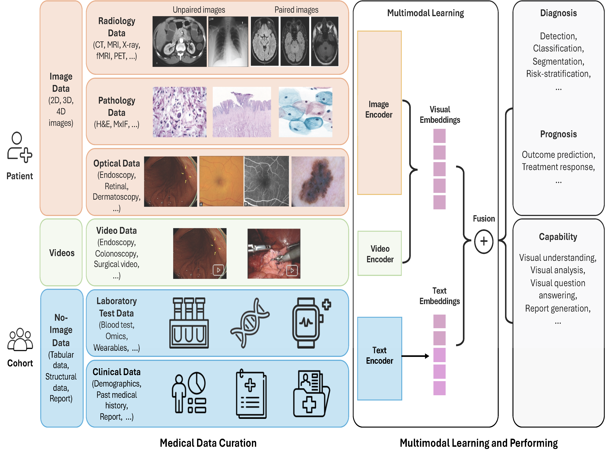

<div align=center>

</div>
<h2 align="center"><a href="https://arxiv.org/pdf/2311.05112.pdf">
Survey for Multimodal Large Language Models in Biomedicine </a></h2>

</h5>

This is an actively updated list of practical guide resources for Biomedical Multimodal Large Language Models (BioMed-MLLMs).
It's based on our survey paper:

Multimodal Large Language Models in Biomedicine

<div align=center>

</div>

## 💬 Update News

[2025-11-11] We updated the 1st version of MLLM4BioMed.

[2025-09-18] We have released the repository of this survey, aiming to collect and organize these updates of MLLMs in biomedicine.

## 📑 Table of Contents

- [⚙️ Methods of Biomedical MLLMs](#-methods-of-biomedical-mllms)
  - [Image-LLMs](#image-llms)
    - [Radiology LLMs](#radiology-llms)
    - [Pathology LLMs](#pathology-llms)
    - [Ophthalmology LLMs](#ophthalmology-llms)
    - [Endoscopy LLMs](#endoscopy-llms)
    - [Dermatology LLMs](#skin-llms)
    - [Multidomain LLMs](#multidomain-llms)
  - [Omics-LLMs](#omics-llms)
  <!-- - [Others-LLMs](#others-llms) -->
  - [Generalist Model](#generalist-model)
- [🧪 Biomedical Datasets for MLLMs](#-biomedical-datasets-for-mllms)
  - [Radiology](#radiology)
  - [Histopathology](#histopathology)
  - [Ophthalmology](#ophthalmology)
  - [Endoscopy](#endoscopy)
  - [Omics](#omics)
  - [Multimodal](#multimodal)
- [💼 For-Profit Multimodal LLMs](#-for-profit-multimodal-llms)
- [🧾 Citation & Acknowledgement](#citation-acknowledgement)


## ⚙️ Methods of Biomedical MLLMs

<details>
<summary><span style="font-size:1.4em; font-weight:600;">📷 Image-LLMs</span></summary>
<div style="margin-left:1em;">

<details>
<summary><b>🩻 Radiology LLMs</b></summary>
<a id="radiology-llms"></a>

<div style="max-height:600px;overflow-y:auto;overflow-x:auto;">

<table style="table-layout:fixed;width:165%;">
  <thead>
    <tr>
      <th style="width:15%;">Model</th>
      <th style="width:50%;">Paper name</th>
      <th style="width:20%;">Conf / Journal</th>
      <th style="width:15%;">Date</th>
    </tr>
  </thead>
  <tbody>

<tr><td><a href="https://github.com/marshuang80/gloria">GLoRIA</a></td><td>GLoRIA: A Multimodal Global-Local Representation Learning Framework for Label-efficient Medical Image Recognition</td><td><a href="https://ieeexplore.ieee.org/document/9710099">ICCV 2021</a></td><td>2021-10-10</td></tr>
<tr><td><a href="https://github.com/SuperSupermoon/MedViLL">MedViLL</a></td><td>Multi-Modal Understanding and Generation for Medical Images and Text via Vision-Language Pre-Training</td><td><a href="https://arxiv.org/abs/2105.11333">Arxiv</a>; <a href="https://ieeexplore.ieee.org/document/9894658">JBHI</a></td><td>2022-09-19</td></tr>
<tr><td><a href="https://sites.google.com/view/repsnet">RepsNet</a></td><td>RepsNet: Combining Vision with Language for Automated Medical Reports</td><td><a href="https://arxiv.org/pdf/2209.13171">Arxiv</a>; <a href="https://link.springer.com/chapter/10.1007/978-3-031-16443-9_68">MICCAI 2022</a></td><td>2022-10-01</td></tr>
<tr><td><a href="https://github.com/yuhaozhang/convirt">ConVIRT</a></td><td>Contrastive Learning of Medical Visual Representations from Paired Images and Text</td><td><a href="https://arxiv.org/abs/2010.00747">Arxiv</a>; <a href="https://proceedings.mlr.press/v182/zhang22a.html">MLCH 2022</a></td><td>2022-10-02</td></tr>
<tr><td><a href="https://github.com/RyanWangZf/MedCLIP">MedCLIP</a></td><td>MedCLIP: Contrastive Learning from Unpaired Medical Images and Text</td><td><a href="https://arxiv.org/abs/2210.10163">Arxiv</a>; <a href="https://aclanthology.org/2022.emnlp-main.256.pdf">EMNLP 2022</a></td><td>2022-12-07</td></tr>
<tr><td><a href="https://github.com/ttumyche/UniXGen">ViewXGen</a></td><td>Vision-Language Generative Model for View-Specific Chest X-ray Generation</td><td><a href="https://arxiv.org/abs/2302.12172">Arxiv</a>; <a href="https://proceedings.mlr.press/v248/lee24a.html">CHIL 2024</a></td><td>2023-02-23</td></tr>
<tr><td><a href="https://github.com/GanjinZero/RAMM">RAMM</a></td><td>Retrieval-augmented Biomedical Visual Question Answering with Multi-modal Pre-training</td><td><a href="https://arxiv.org/abs/2303.00534">Arxiv</a>; <a href="https://dl.acm.org/doi/10.1145/3581783.3611830">MM 2023</a></td><td>2023-03-01</td></tr>
<tr><td><a href="https://github.com/rajpurkarlab/X-REM">X-REM</a></td><td>Multimodal Image-Text Matching Improves Retrieval-based Chest X-Ray Report Generation</td><td><a href="https://arxiv.org/abs/2303.17579">Arxiv</a>; <a href="https://openreview.net/forum?id=aZ0OuYMSMMZ">MIDL 2023</a></td><td>2023-03-29</td></tr>
<tr><td><a href="https://github.com/sarahESL/PubMedCLIP">PubMedCLIP</a></td><td>How Much Does CLIP Benefit Visual Question Answering in the Medical Domain?</td><td><a href="https://arxiv.org/abs/2112.13906">Arxiv</a>; <a href="https://aclanthology.org/2023.findings-eacl.88">EACL 2023</a></td><td>2023-05-01</td></tr>
<tr><td><a href="https://github.com/pengfeiliHEU/MUMC">MUMC</a></td><td>Masked Vision and Language Pre-training with Unimodal and Multimodal Contrastive Losses for Medical Visual Question Answering</td><td><a href="https://arxiv.org/abs/2307.05314">Arxiv</a>; <a href="https://link.springer.com/chapter/10.1007/978-3-031-43907-0_36">MICCAI 2023</a></td><td>2023-10-08</td></tr>
<tr><td><a href="https://www.microsoft.com/en-us/research/project/project-maira/">MAIRA-1</a></td><td>A specialised large multimodal model for radiology report generation</td><td><a href="https://arxiv.org/abs/2311.13668">Arxiv</a>; <a href="https://aclanthology.org/2024.bionlp-1.50/">BioNLP-ACL 2024</a></td><td>2023-11-01</td></tr>
<tr><td>Med-MLLM</td><td>A medical multimodal large language model for future pandemics</td><td><a href="https://www.nature.com/articles/s41746-023-00952-2">NPJ Digital Medicine</a></td><td>2023-12-02</td></tr>
<tr><td><a href="https://github.com/Stanford-AIMI/CheXagent">CheXagent</a></td><td>A Vision-Language Foundation Model to Enhance Efficiency of Chest X-ray Interpretation</td><td><a href="https://arxiv.org/abs/2401.12208">Arxiv</a></td><td>2024-01-22</td></tr>
<tr><td><a href="https://github.com/mbzuai-oryx/XrayGPT">XrayGPT</a></td><td>Chest Radiographs Summarization using Medical Vision-Language Models</td><td><a href="https://arxiv.org/abs/2306.07971">Arxiv</a>; <a href="https://aclanthology.org/2024.bionlp-1.35.pdf">BioNLP-ACL 2024</a></td><td>2024-08-16</td></tr>
<tr><td>OaD</td><td>An Organ-aware Diagnosis Framework for Radiology Report Generation</td><td><a href="https://ieeexplore.ieee.org/document/10579857">TMI</a></td><td>2024-07-01</td></tr>
<tr><td><a href="https://github.com/CUHK-AIM-Group/MCPL">MCPL</a></td><td>Multi-Modal Collaborative Prompt Learning for Medical Vision-Language Model</td><td><a href="https://ieeexplore.ieee.org/document/10570257">TMI</a></td><td>2024-06-24</td></tr>
<tr><td>ClinicalBLIP</td><td>Vision-Language Model for Generating Textual Descriptions From Clinical Images</td><td><a href="https://formative.jmir.org/2024/1/e32690">JMIR Form Res</a></td><td>2024-08-02</td></tr>
<tr><td><a href="https://github.com/ibrahimethemhamamci/CT2Rep">CT2Rep</a></td><td>Automated Radiology Report Generation for 3D Medical Imaging</td><td><a href="https://arxiv.org/abs/2403.06801">Arxiv</a>; <a href="https://link.springer.com/chapter/10.1007/978-3-031-72390-2_45">MICCAI 2024</a></td><td>2024-10-01</td></tr>
<tr><td><a href="https://github.com/ibrahimethemhamamci/CT-CHAT">CTChat</a></td><td>Developing Generalist Foundation Models from a Multimodal Dataset for 3D CT</td><td><a href="https://arxiv.org/abs/2403.17834">Arxiv</a></td><td>2024-10-16</td></tr>
<tr><td><a href="https://github.com/StanfordMIMI/Merlin">Merlin</a></td><td>A Vision Language Foundation Model for 3D Computed Tomography</td><td><a href="https://arxiv.org/abs/2406.06512">Arxiv</a>; <a href="#">Res Sq</a></td><td>2025-06-28</td></tr>
<tr><td><a href="https://github.com/tvseg/MM-LLM-RO">LLMSeg</a></td><td>LLM-driven multimodal target volume contouring in radiation oncology</td><td><a href="https://arxiv.org/abs/2311.01908">Arxiv</a>; <a href="https://www.nature.com/articles/s41467-024-53387-y">Nat. Commun.</a></td><td>2024-10-24</td></tr>
<tr><td>Flamingo-CXR</td><td>Collaboration between clinicians and vision–language models in radiology report generation</td><td><a href="https://arxiv.org/abs/2311.18260">Arxiv</a>; <a href="https://www.nature.com/articles/s41591-024-03302-1">Nat. Med.</a></td><td>2024-11-07</td></tr>
<tr><td><a href="https://www.microsoft.com/en-us/research/project/project-maira/">MAIRA-2</a></td><td>Grounded Radiology Report Generation</td><td><a href="https://arxiv.org/abs/2406.04449">Arxiv</a></td><td>2024-06-06</td></tr>
<tr><td><a href="https://www.microsoft.com/en-us/research/project/project-maira/">MAIRA-Seg</a></td><td>Segmentation-Aware Multimodal Large Language Models</td><td><a href="https://arxiv.org/abs/2411.11362">Arxiv</a>; <a href="https://proceedings.mlr.press/v259/sharma25a.html">MLHS 2024</a></td><td>2024-12-15</td></tr>
<tr><td><a href="https://github.com/ECOFRI/CXR_LLaVA">CXR-LLaVA</a></td><td>A multimodal large language model for interpreting chest X-rays</td><td><a href="https://arxiv.org/abs/2310.18341">Arxiv</a>; <a href="https://link.springer.com/article/10.1007/s00330-024-11339-6">Eur. Radiol.</a></td><td>2025-01-15</td></tr>
<tr><td><a href="https://github.com/StanfordMIMI/RoentGen">RoentGen</a></td><td>A vision–language foundation model for the generation of realistic chest X-ray images</td><td><a href="https://www.nature.com/articles/s41551-024-01246-y">Nat. Biomed Eng.</a></td><td>2025-04-09</td></tr>
<tr><td><a href="https://github.com/ChantalMP/RaDialog">RaDialog</a></td><td>A Large Vision-Language Model for Radiology Report Generation and Conversational Assistance</td><td><a href="https://arxiv.org/abs/2311.18681">Arxiv</a>; <a href="#">MIDL 2025</a></td><td>2025-07-09</td></tr>
<tr><td><a href="https://github.com/chaoyi-wu/RadFM">RadFM</a></td><td>Towards Generalist Foundation Model for Radiology by Leveraging Web-scale 2D&3D Data</td><td><a href="https://arxiv.org/abs/2308.02463">Arxiv</a>; <a href="https://www.nature.com/articles/s41467-025-62385-7">Nat. Commun.</a></td><td>2025-08-23</td></tr>

  </tbody>
</table>

</div>
</details>

<details>
<summary><b>🧫 Pathology LLMs</b></summary>
<a id="pathology-llms"></a>

<div style="max-height:600px;overflow-y:auto;overflow-x:auto;">

<table style="table-layout:fixed;width:165%;">
  <thead>
    <tr>
      <th style="width:15%;">Model</th>
      <th style="width:50%;">Paper name</th>
      <th style="width:20%;">Conf / Journal</th>
      <th style="width:15%;">Date</th>
    </tr>
  </thead>
  <tbody>

<tr><td> TraP-VQA</td><td>Vision-language transformer for interpretable pathology visual question answering</td><td><a href="https://ieeexplore.ieee.org/document/9745795">JBHI 2022</a></td><td>2022-03-31</td></tr>
<tr><td> K-PathVQA</td><td>K-PathVQA: Knowledge-Aware Multimodal Representation for Pathology Visual Question Answering</td><td><a href="https://ieeexplore.ieee.org/document/10177927">JBHI 2023</a></td><td>2023-07-11</td></tr>
<tr><td><a href="https://huggingface.co/spaces/vinid/webplip"> PLIP</a></td><td>A visual-language foundation model for pathology image analysis using medical Twitter</td><td><a href="https://www.nature.com/articles/s41591-023-02504-3">Nat. Med.</a></td><td>2023-09-29</td></tr>
<tr><td><a href="https://github.com/superjamessyx/Generative-Foundation-AI-Assistant-for-Pathology"> PathAsst</a></td><td>PathAsst: A Generative Foundation AI Assistant Towards Artificial General Intelligence of Pathology</td><td><a href="https://arxiv.org/abs/2305.15072">Arxiv</a>; <a href="#">AAAI 2024</a></td><td>2024-02-24</td></tr>
<tr><td> CONCH</td><td>A visual-language foundation model for computational pathology</td><td><a href="https://www.nature.com/articles/s41591-024-02856-4">Nat. Med.</a></td><td>2024-03-19</td></tr>
<tr><td><a href="https://github.com/prov-gigapath/prov-gigapath"> Prov-GigaPath</a></td><td>A whole-slide foundation model for digital pathology from real-world data</td><td><a href="https://www.nature.com/articles/s41586-024-07441-w">Nat.</a></td><td>2024-05-22</td></tr>
<tr><td><a href="https://github.com/fedshyvana/pathology_mllm_training"> PathChat</a></td><td>A multimodal generative AI copilot for human pathology</td><td><a href="https://www.nature.com/articles/s41586-024-07618-3">Nat.</a></td><td>2024-06-12</td></tr>
<tr><td><a href="https://quilt-llava.github.io/"> Quilt-LLaVA</a></td><td>Quilt-LLaVA: Visual Instruction Tuning by Extracting Localized Narratives from Open-Source Histopathology Videos</td><td><a href="https://arxiv.org/abs/2312.04746">Arxiv</a>; <a href="https://openaccess.thecvf.com/content/CVPR2024/html/Seyfioglu_Quilt-LLaVA_Visual_Instruction_Tuning_by_Extracting_Localized_Narratives_from_Open-Source_CVPR_2024_paper.html">CVPR 2024</a></td><td>2024-06-19</td></tr>
<tr><td><a href="https://github.com/Jiangbo-Shi/ViLa-MIL"> ViLa-MIL</a></td><td>Dual-scale Vision-Language Multiple Instance Learning for Whole Slide Image Classification</td><td><a href="https://arxiv.org/abs/2502.08391">Arxiv</a>; <a href="https://openaccess.thecvf.com/content/CVPR2024/papers/Shi_ViLa-MIL_Dual-scale_Vision-Language_Multiple_Instance_Learning_for_Whole_Slide_Image_CVPR_2024_paper.pdf">CVPR 2024</a></td><td>2024-06-19</td></tr>
<tr><td><a href="https://github.com/cpystan/Wsi-Caption"> WsiCaption</a></td><td>WsiCaption: Multiple Instance Generation of Pathology Reports for Gigapixel Whole-Slide Images</td><td><a href="https://arxiv.org/abs/2311.16480">Arxiv</a>; <a href="https://link.springer.com/chapter/10.1007/978-3-031-72083-3_51">MICCAI 2024</a></td><td>2024-10-16</td></tr>
<tr><td><a href="https://github.com/cpystan/WSI-VQA."> WSI-VQA</a></td><td>WSI-VQA: Interpreting Whole Slide Images by Generative Visual Question Answering</td><td><a href="https://arxiv.org/abs/2407.05603">Arxiv</a>; <a href="https://link.springer.com/chapter/10.1007/978-3-031-72764-1_23">ECCV 2024</a></td><td>2024-10-25</td></tr>
<tr><td><a href="https://github.com/hms-dbmi/CHIEF"> CHIEF</a></td><td>A pathology foundation model for cancer diagnosis and prognosis prediction</td><td><a href="https://www.nature.com/articles/s41586-024-07894-z">Nat.</a></td><td>2024-09-04</td></tr>
<tr><td><a href="https://github.com/mahmoodlab/TITAN"> TITAN</a></td><td>Multimodal Whole Slide Foundation Model for Pathology</td><td><a href="https://arxiv.org/abs/2411.19666">Arxiv</a></td><td>2024-11-29</td></tr>
<tr><td><a href="https://github.com/lilab-stanford/MUSK"> MUSK</a></td><td>A vision–language foundation model for precision oncology</td><td><a href="https://www.nature.com/articles/s41586-024-08378-w">Nat.</a></td><td>2025-01-08</td></tr>
<tr><td><a href="https://github.com/ddw2AIGROUP2CQUPT/PA-LLaVA"> PathologyVLM</a></td><td>PathologyVLM: a large vision-language model for pathology image understanding</td><td><a href="https://link.springer.com/article/10.1007/s10462-025-11190-1">Artif. Intell. Rev.</a></td><td>2025-03-28</td></tr>
<tr><td><a href="https://github.com/PathFoundation/CPath-Omni"> CPath-Omni</a></td><td>CPath-Omni: A Unified Multimodal Foundation Model for Patch and Whole Slide Image Analysis in Computational Pathology</td><td><a href="https://openaccess.thecvf.com/content/CVPR2025/html/Sun_CPath-Omni_A_Unified_Multimodal_Foundation_Model_for_Patch_and_Whole_CVPR_2025_paper.html">CVPR 2025</a></td><td>2025-06-11</td></tr>
<tr><td><a href="https://uni-medical.github.io/SlideChat.github.io"> SlideChat</a></td><td>SlideChat: A Large Vision-Language Assistant for Whole-Slide Pathology Image Understanding</td><td><a href="https://arxiv.org/pdf/2410.11761">Arxiv</a>; <a href="https://openaccess.thecvf.com/content/CVPR2025/papers/Chen_SlideChat_A_Large_Vision-Language_Assistant_for_Whole-Slide_Pathology_Image_Understanding_CVPR_2025_paper.pdf">CVPR 2025</a></td><td>2025-06-11</td></tr>
<tr><td> PRISM</td><td>PRISM: A Multi-Modal Generative Foundation Model for Slide-Level Histopathology</td><td><a href="https://arxiv.org/abs/2405.10254">Arxiv</a></td><td>2025-05-16</td></tr>
<tr><td> PRISM2</td><td>PRISM2: Unlocking Multi-Modal General Pathology AI with Clinical Dialogue</td><td><a href="https://arxiv.org/html/2506.13063v1">Arxiv</a></td><td>2025-06-16</td></tr>
<tr><td><a href="https://github.com/XinhengLyu/WSI-LLaVA"> WSI-LLaVA</a></td><td>WSI-LLaVA: A Multimodal Large Language Model for Whole Slide Image</td><td><a href="https://arxiv.org/abs/2412.02141">Arxiv</a>; <a href="#">ICCV 2025</a></td><td>2025-10-19</td></tr>

  </tbody>
</table>

</div>
</details>

<details>
<summary><b>👁️ Ophthalmology LLMs</b></summary>
<a id="ophthalmology-llms"></a>

<div style="max-height:600px;overflow-y:auto;overflow-x:auto;">

<table style="table-layout:fixed;width:165%;">
  <thead>
    <tr>
      <th style="width:15%;">Model</th>
      <th style="width:50%;">Paper name</th>
      <th style="width:20%;">Conf / Journal</th>
      <th style="width:15%;">Date</th>
    </tr>
  </thead>
  <tbody>

<tr><td><a href="https://github.com/rmaphoh/RETFound_MAE">RETFound</a></td><td>A foundation model for generalizable disease detection from retinal images</td><td><a href="https://www.nature.com/articles/s41586-023-06555-x">Nat.</a></td><td>2023-09-13</td></tr>
<tr><td><a href="https://github.com/sperfu/EyeDoc">EyeDoctor</a></td><td>A Role-specific Guided Large Language Model for Ophthalmic Consultation Based on Stylistic Differentiation</td><td><a href="https://arxiv.org/pdf/2407.18483">Arxiv</a></td><td>2024-06-24</td></tr>
<tr><td><a href="https://github.com/ML-AILab/OphGLM">OphGLM</a></td><td>OphGLM: Training an Ophthalmology Large Language-and-Vision Assistant based on Instructions and Dialogue</td><td><a href="https://arxiv.org/abs/2306.12174">Arxiv</a>; <a href="https://www.sciencedirect.com/science/article/pii/S0933365724002434">AI in Medicine 2024</a></td><td>2024-11-01</td></tr>
<tr><td><a href="https://github.com/ABILab-CUHK/VisionFM">VisionFM</a></td><td>Development and Validation of a Multimodal Multitask Vision Foundation Model for Generalist Ophthalmic Artificial Intelligence</td><td><a href="https://arxiv.org/abs/2310.04992">Arxiv</a>; <a href="https://ai.nejm.org/doi/full/10.1056/AIoa2300221">NEJM AI 2024</a></td><td>2024-11-27</td></tr>
<tr><td><a href="https://github.com/huggingface/pytorch-image-models/blob/main/timm/models/resnet.py">IOMIDS</a></td><td>Multimodal machine learning enables AI chatbot to diagnose ophthalmic diseases and provide high-quality medical responses</td><td><a href="https://www.nature.com/articles/s41746-025-01461-0">npj Digit. Med.</a></td><td>2025-01-27</td></tr>
<tr><td><a href="https://github.com/jusiro/FLAIR?tab=readme-ov-file#flair-a-foundation-language-image-model-of-the-retina">FLAIR</a></td><td>A Foundation Language-Image Model of the Retina (FLAIR): encoding expert knowledge in text supervision</td><td><a href="https://www.sciencedirect.com/science/article/pii/S1361841524002822">Med. Img. Anal.</a></td><td>2025-01-01</td></tr>
<tr><td>LMOD</td><td>A Large Multimodal Ophthalmology Dataset and Benchmark for Vision-Language Models</td><td><a href="https://arxiv.org/abs/2410.01620">Arxiv</a>; <a href="#">NAACL 2025</a></td><td>2025-04-29</td></tr>
<tr><td><a href="https://github.com/Michi-3000/EyeCLIP">EyeCLIP</a></td><td>A Multimodal Generalist Foundation Model for Ophthalmic Imaging</td><td><a href="https://arxiv.org/pdf/2405.11338">Arxiv</a>; <a href="https://www.nature.com/articles/s41746-025-01772-2">npj Digit. Med.</a></td><td>2025-06-21</td></tr>
<tr><td><a href="https://github.com/LooKing9218/RetiZero">RetiZero</a></td><td>Enhancing diagnostic accuracy in rare and common fundus diseases with a knowledge-rich vision-language model</td><td><a href="https://www.nature.com/articles/s41467-025-60577-9">Nat. Commun.</a></td><td>2025-07-01</td></tr>
<tr><td><a href="https://github.com/HUANGLIZI/VisionUnite">VisionUnite</a></td><td>VisionUnite: A Vision-Language Foundation Model for Ophthalmology Enhanced with Clinical Knowledge</td><td><a href="https://arxiv.org/pdf/2408.02865">Arxiv</a>; <a href="https://ieeexplore.ieee.org/document/11124413">TPAMI 2025</a></td><td>2025-08-13</td></tr>
<tr><td><a href="https://github.com/eyefm/EyeFM">EyeFM</a></td><td>An eyecare foundation model for clinical assistance: a randomized controlled trial</td><td><a href="https://www.nature.com/articles/s41591-025-03900-7">Nat. Med.</a></td><td>2025-08-28</td></tr>

  </tbody>
</table>

</div>
</details>

<details>
<summary><b>🩺 Endoscopy & Surgical LLMs</b></summary>
<a id="endoscopy-llms"></a>

<div style="max-height:600px;overflow-y:auto;overflow-x:auto;">

<table style="table-layout:fixed;width:165%;">
  <thead>
    <tr>
      <th style="width:15%;">Model</th>
      <th style="width:50%;">Paper name</th>
      <th style="width:20%;">Conf / Journal</th>
      <th style="width:15%;">Date</th>
    </tr>
  </thead>
  <tbody>

<tr><td>Surgical-VQA</td><td>Surgical-VQA: visual question answering in surgical scenes using transformer</td><td><a href="https://link.springer.com/chapter/10.1007/978-3-031-16449-1_4">MICCAI 2022</a></td><td>2022-09-17</td></tr>
<tr><td><a href="https://github.com/MembrAI/MIU-VL">MIU-VL</a></td><td>Medical Image Understanding with Pretrained Vision Language Models: A Comprehensive Study</td><td><a href="https://arxiv.org/abs/2209.15517">Arxiv</a>; <a href="https://openreview.net/forum?id=txlWziuCE5W">ICLR 2023</a></td><td>2023-02-01</td></tr>
<tr><td><a href="https://github.com/longbai1006/CAT-ViL">CAT-ViL DeiT</a></td><td>CAT-ViL: Co-Attention Gated Vision-Language Embedding for Visual Question Localized-Answering in Robotic Surgery</td><td><a href="https://arxiv.org/abs/2307.05182">Arxiv</a>; <a href="https://link.springer.com/chapter/10.1007/978-3-031-43996-4_38">MICCAI 2023</a></td><td>2023-10-01</td></tr>
<tr><td>SurgicalGPT</td><td>SurgicalGPT: End-to-end language-vision GPT for visual question answering in surgery</td><td><a href="https://arxiv.org/abs/2304.09974">Arxiv</a>; <a href="https://link.springer.com/chapter/10.1007/978-3-031-43996-4_27">MICCAI 2023</a></td><td>2023-10-01</td></tr>
<tr><td>LLaVA-Surg</td><td>LLaVA-Surg: Towards Multimodal Surgical Assistant via Structured Surgical Video Learning</td><td><a href="https://arxiv.org/abs/2408.07981">Arxiv</a></td><td>2024-08-15</td></tr>
<tr><td><a href="https://github.com/jinlab-imvr/SurgRAW">SurgRAW</a></td><td>SurgRAW: Multi-Agent Workflow with Chain-of-Thought Reasoning for Surgical Intelligence</td><td><a href="https://arxiv.org/abs/2503.10265">Arxiv</a></td><td>2025-03-13</td></tr>
<tr><td>SurgVidLM</td><td>SurgVidLM: Towards Multi-grained Surgical Video Understanding with Large Language Model</td><td><a href="https://arxiv.org/abs/2506.17873">Arxiv</a></td><td>2025-06-22</td></tr>

  </tbody>
</table>

</div>
</details>

<details>
<summary><b>🧴 Dermatology LLMs</b></summary>
<a id="skin-llms"></a>

<div style="max-height:600px;overflow-y:auto;overflow-x:auto;">

<table style="table-layout:fixed;width:165%;">
  <thead>
    <tr>
      <th style="width:15%;">Model</th>
      <th style="width:50%;">Paper name</th>
      <th style="width:20%;">Conf / Journal</th>
      <th style="width:15%;">Date</th>
    </tr>
  </thead>
  <tbody>

<tr><td><a href="https://github.com/suinleelab/MONET">MONET</a></td><td>Transparent medical image AI via an image–text foundation model grounded in medical literature</td><td><a href="https://www.nature.com/articles/s41591-024-02887-x">Nat. Med.</a></td><td>2024-04-16</td></tr>
<tr><td>SkinGPT-4</td><td>Pre-trained multimodal large language model enhances dermatological diagnosis using SkinGPT-4</td><td><a href="https://www.nature.com/articles/s41467-024-50043-3">Nat. Commun.</a></td><td>2024-06-05</td></tr>
<tr><td><a href="https://github.com/SiyuanYan1/PanDerm">PanDerm</a></td><td>A multimodal vision foundation model for clinical dermatology</td><td><a href="https://www.nature.com/articles/s41591-025-03747-y">Nat. Med.</a></td><td>2025-06-06</td></tr>

  </tbody>
</table>

</div>
</details>

<details>
<summary><b>🧠 Multidomain LLMs</b></summary>
<a id="multidomain-llms"></a>

<div style="max-height:600px;overflow-y:auto;overflow-x:auto;">

<table style="table-layout:fixed;width:165%;">
  <thead>
    <tr>
      <th style="width:15%;">Model</th>
      <th style="width:50%;">Paper name</th>
      <th style="width:20%;">Conf / Journal</th>
      <th style="width:15%;">Date</th>
    </tr>
  </thead>
  <tbody>

<tr><td>TV-SAM</td><td>TV-SAM: Increasing Zero-Shot Segmentation Performance on Multimodal Medical Images Using GPT-4 Generated Descriptive Prompts Without Human Annotation</td><td><a href="https://arxiv.org/pdf/2402.15759">Arxiv</a>; <a href="https://www.sciopen.com/article/10.26599/BDMA.2024.9020058">BDMA 2024</a></td><td>2024-12-04</td></tr>
<tr><td><a href="https://github.com/StandWisdom/MRI-based-Predicted-Transformer-for-Prostate-cancer">MRI-PTPCa</a></td><td>An MRI–pathology foundation model for noninvasive diagnosis and grading of prostate cancer</td><td><a href="https://www.nature.com/articles/s43018-025-01041-x">Nat. Can.</a></td><td>2025-09-02</td></tr>

  </tbody>
</table>

</div>
</details>

</details>


<details>
<summary><span style="font-size:1.4em; font-weight:600;">🧬 Omics-LLMs</span></summary>
<a id="omics-llms"></a>

<div style="max-height:600px;overflow-y:auto;overflow-x:auto;">

<table style="table-layout:fixed;width:165%;">
  <thead>
    <tr>
      <th style="width:15%;">Model</th>
      <th style="width:50%;">Paper name</th>
      <th style="width:20%;">Conf / Journal</th>
      <th style="width:15%;">Date</th>
    </tr>
  </thead>
  <tbody>

<tr><td><a href="https://huggingface.co/insilicomedicine/precious3-gpt-multi-modal">Precious3GPT</a></td><td>Multimodal Multi-Species Multi-Omics Multi-Tissue Transformer for Aging Research and Drug Discovery</td><td><a href="https://www.biorxiv.org/content/10.1101/2024.07.25.605062v1">bioRxiv</a></td><td>2024-07-25</td></tr>
<tr><td><a href="https://github.com/yiqunchen/GenePT">GenePT</a></td><td>Simple and effective embedding model for single-cell biology built from ChatGPT</td><td><a href="https://www.nature.com/articles/s41551-024-01284-6">Nat. Biomed. Eng.</a></td><td>2024-12-06</td></tr>
<tr><td><a href="https://github.com/HelloWorldLTY/scELMo">scELMo</a></td><td>Embeddings from Language Models are Good Learners for Single-cell Data Analysis</td><td><a href="https://www.biorxiv.org/content/10.1101/2023.12.07.569910v3">bioRxiv</a></td><td>2023-12-08</td></tr>
<tr><td><a href="https://github.com/PharMolix/LangCell">LangCell</a></td><td>Language-Cell Pre-training for Cell Identity Understanding</td><td><a href="https://arxiv.org/pdf/2405.06708">arXiv</a></td><td>2024-06-11</td></tr>
<tr><td><a href="https://github.com/epigen/cellwhisperer">CellWhisperer</a></td><td>Multimodal learning of transcriptomes and text enables interactive single-cell RNA-seq data exploration with natural-language chats</td><td><a href="https://www.biorxiv.org/content/10.1101/2024.10.15.618501v1">bioRxiv</a></td><td>2024-10-18</td></tr>
<tr><td><a href="https://github.com/SuperBianC/scMulan">scMulan</a></td><td>A Multitask Generative Pre-trained Language Model for Single-Cell Analysis</td><td><a href="https://www.biorxiv.org/content/10.1101/2024.01.25.577152v1">bioRxiv</a>; <a href="https://link.springer.com/content/pdf/10.1007/978-1-0716-3989-4.pdf">RECOMB 2024</a></td><td>2024-05-17</td></tr>
<tr><td>scInterpreter</td><td>Training Large Language Models to Interpret scRNA-seq Data for Cell Type Annotation</td><td><a href="https://arxiv.org/pdf/2402.12405">arXiv</a></td><td>2024-02-18</td></tr>
<tr><td><a href="https://github.com/vandijklab/cell2sentence-ft">Cell2Sentence</a></td><td>Teaching Large Language Models the Language of Biology</td><td><a href="https://www.biorxiv.org/content/10.1101/2023.09.11.557287v4">bioRxiv</a>; <a href="https://openreview.net/forum?id=EWt5wsEdvc">ICML 2024</a></td><td>2024-05-01</td></tr>
<tr><td>GPT-4 (for scRNA-seq)</td><td>Assessing GPT-4 for cell type annotation in single-cell RNA-seq analysis</td><td><a href="https://www.biorxiv.org/content/10.1101/2023.04.16.537094v2">bioRxiv</a>; <a href="https://www.nature.com/articles/s41592-024-02235-4.pdf">Nat. Methods Brief Comm.</a></td><td>2024-03-25</td></tr>
<tr><td><a href="https://github.com/portrai-io/CELLama">CELLama</a></td><td>Foundation Model for Single Cell and Spatial Transcriptomics by Cell Embedding Leveraging Language Model Abilities</td><td><a href="https://www.biorxiv.org/content/10.1101/2024.05.08.593094v1">bioRxiv</a></td><td>2024-05-10</td></tr>

  </tbody>
</table>

</div>
</details>


<details>
<summary><span style="font-size:1.4em; font-weight:600;">🌐 Generalist Models</span></summary>
<a id="generalist-llms"></a>

<div style="max-height:600px;overflow-y:auto;overflow-x:auto;">

<table style="table-layout:fixed;width:165%;">
  <thead>
    <tr>
      <th style="width:15%;">Model</th>
      <th style="width:50%;">Paper name</th>
      <th style="width:20%;">Conf / Journal</th>
      <th style="width:15%;">Date</th>
    </tr>
  </thead>
  <tbody>

<tr><td><a href="https://github.com/microsoft/LLaVA-Med?tab=readme-ov-file">LLaVA-Med</a></td><td>Training a Large Language-and-Vision Assistant for Biomedicine in One Day</td><td><a href="https://arxiv.org/abs/2306.00890">arXiv</a>; <a href="https://openreview.net/forum?id=GSuP99u2kR">NeurIPS 2023</a></td><td>2023-09-25</td></tr>
<tr><td>GPT-4v-med</td><td>GPT-4v</td><td><a href="https://cdn.openai.com/papers/GPTV_System_Card.pdf">OpenAI Report</a></td><td>2023-09-25</td></tr>
<tr><td><a href="https://github.com/snap-stanford/med-flamingo">Med-Flamingo</a></td><td>A Multimodal Medical Few-shot Learner</td><td><a href="https://arxiv.org/abs/2307.15189">arXiv</a>; <a href="https://proceedings.mlr.press/v225/moor23a.html">ML4H 2023</a></td><td>2023-12-10</td></tr>
<tr><td><a href="https://sites.research.google/med-palm/">Med-PaLM M</a></td><td>Towards Generalist Biomedical AI</td><td><a href="https://arxiv.org/abs/2307.14334">arXiv</a>; <a href="https://ai.nejm.org/doi/full/10.1056/AIoa2300138">NEJM AI</a></td><td>2024-02-22</td></tr>
<tr><td><a href="https://github.com/zhaozh10/ChatCAD">ChatCAD+</a></td><td>Toward a Universal and Reliable Interactive CAD Using LLMs</td><td><a href="https://arxiv.org/abs/2305.15964">arXiv</a>; <a href="https://ieeexplore.ieee.org/abstract/document/10522762">IEEE 2024</a></td><td>2024-05-08</td></tr>
<tr><td><a href="https://github.com/OpenGVLab/InternVL">InternVL</a></td><td>Scaling up Vision Foundation Models and Aligning for Generic Visual-Linguistic Tasks</td><td><a href="https://arxiv.org/abs/2312.14238">arXiv</a>; <a href="https://openaccess.thecvf.com/content/CVPR2024/papers/Chen_InternVL_Scaling_up_Vision_Foundation_Models_and_Aligning_for_Generic_CVPR_2024_paper.pdf">CVPR 2024</a></td><td>2024-06-17</td></tr>
<tr><td><a href="https://huggingface.co/hyzhou/MedVersa_Internal">MedVersa</a></td><td>A Generalist Foundation Model for Medical Image Interpretation</td><td><a href="https://arxiv.org/abs/2405.07988">arXiv</a></td><td>2024-05-13</td></tr>
<tr><td><a href="https://github.com/taokz/BiomedGPT?tab=readme-ov-file">BiomedGPT</a></td><td>A Generalist Vision–Language Foundation Model for Diverse Biomedical Tasks</td><td><a href="https://arxiv.org/abs/2305.17100">arXiv</a>; <a href="https://www.nature.com/articles/s41591-024-03185-2">Nat. Med.</a></td><td>2024-08-07</td></tr>
<tr><td><a href="https://huggingface.co/togethercomputer/Llama-3.1-8B-Dragonfly-Med-v2">Dragonfly-Med</a></td><td>Multi-Resolution Zoom-In Encoding Enhances Vision-Language Models</td><td><a href="https://arxiv.org/abs/2406.00977">arXiv</a>; <a href="https://openreview.net/forum?id=4FRUNLuY54">OpenReview 2024</a></td><td>2024-10-14</td></tr>
<tr><td><a href="https://huggingface.co/microsoft/BiomedCLIP-PubMedBERT_256-vit_base_patch16_224">BiomedCLIP</a></td><td>A Multimodal Biomedical Foundation Model Pretrained from Fifteen Million Scientific Image-Text Pairs</td><td><a href="https://arxiv.org/abs/2303.00915">arXiv</a>; <a href="https://ai.nejm.org/doi/full/10.1056/AIoa2400640">NEJM AI</a></td><td>2024-12-20</td></tr>
<tr><td><a href="https://github.com/BigData-KSU/Vision-BioLLM-KSU">Vision-BioLLM</a></td><td>Large Vision Language Model for Visual Dialogue in Biomedical Imagery</td><td><a href="https://www.sciencedirect.com/science/article/pii/S1746809424014952">BSPC 2025</a></td><td>2025-01-03</td></tr>
<tr><td>MedGemini</td><td>Capabilities of Gemini Models in Medicine</td><td><a href="https://arxiv.org/abs/2404.18416">arXiv</a></td><td>2024-04-29</td></tr>
<tr><td>Lingshu</td><td>A Generalist Foundation Model for Unified Multimodal Medical Understanding and Reasoning</td><td><a href="https://arxiv.org/abs/2506.07044">arXiv</a></td><td>2025-06-08</td></tr>

  </tbody>
</table>

</div>
</details>


## 🧪 Biomedical Datasets for MLLMs

<details>
<summary><b>🩻 Radiology Datasets</b></summary>
<a id="radiology"></a>

<div style="max-height:450px;overflow-y:auto;overflow-x:auto;">

<table style="table-layout:fixed;width:150%;">
  <thead>
    <tr>
      <th style="width:20%;">Dataset</th>
      <th style="width:20%;">Modality</th>
      <th style="width:10%;">Scale (imgs)</th>
      <th style="width:10%;">Text (QA)</th>
      <th style="width:30%;">Conf / Journal</th>
      <th style="width:20%;">Date</th>
      <th style="width:20%;">Capability</th>
    </tr>
  </thead>
  <tbody>

<tr><td><a href="https://huggingface.co/datasets/ibrahimhamamci/CT-RATE">CT-RATE</a></td><td>Img, Text</td><td>25.6k</td><td>25.6k</td><td><a href="https://arxiv.org/abs/2403.17834">arXiv</a></td><td>2024-10-16</td><td>classification, report</td></tr>
<tr><td><a href="https://github.com/MrGiovanni/RadGPT">RadGPT</a></td><td>Img, Text</td><td>2.7M</td><td>1.8M</td><td><a href="https://arxiv.org/abs/2501.04678">arXiv</a>; ICCV 2025</td><td>2025-10-19</td><td>segmentation, report</td></tr>
<tr><td><a href="https://bimcv.cipf.es/bimcv-projects/padchest/">PadChest</a></td><td>Img, Text</td><td>160k</td><td>160k</td><td><a href="https://arxiv.org/abs/1901.07441">arXiv</a>; <a href="https://www.sciencedirect.com/science/article/abs/pii/S1361841520301614">Med. Image Anal.</a></td><td>2020-08-20</td><td>classification, captioning</td></tr>
<tr><td><a href="https://physionet.org/content/mimic-cxr/2.1.0/">MIMIC-CXR</a></td><td>EHR, Img, Text</td><td>377k</td><td>227k</td><td><a href="https://arxiv.org/abs/1901.07042">arXiv</a>; <a href="https://www.nature.com/articles/s41597-019-0322-0">Nat. Sci. Data</a></td><td>2019-12-12</td><td>classification, captioning</td></tr>
<tr><td><a href="https://figshare.com/articles/dataset/CANDID-PTX/14173982">CANDID-PTX</a></td><td>Img, Mask, Text</td><td>19k</td><td>19k</td><td><a href="https://pubs.rsna.org/doi/full/10.1148/ryai.2021210136">Radiology AI</a></td><td>2021-10-13</td><td>classification, segmentation, report</td></tr>
<tr><td><a href="https://aimi.stanford.edu/datasets/chexpert-plus">CheXpert Plus</a></td><td>Img, Text</td><td>223k</td><td>223k</td><td><a href="https://arxiv.org/abs/2405.19538">arXiv</a></td><td>2024-05-29</td><td>classification, captioning, report</td></tr>
<tr><td><a href="https://bimcv.cipf.es/bimcv-projects/padchest-gr/">PadChest-GR</a></td><td>Img, Bbox, Text</td><td>4.5k</td><td>10.4k</td><td><a href="https://arxiv.org/abs/2411.05085">arXiv</a></td><td>2024-11-07</td><td>classification, report</td></tr>
<tr><td><a href="https://github.com/razorx89/roco-dataset">ROCO</a></td><td>Img, Text</td><td>87k</td><td>87k</td><td><a href="https://link.springer.com/chapter/10.1007/978-3-030-01364-6_20">LABELS 2018</a></td><td>2018-10-17</td><td>classification, captioning</td></tr>
<tr><td><a href="https://github.com/sctg-development/ROCOv2-radiology">ROCOv2</a></td><td>Img, Text</td><td>79k</td><td>79k</td><td><a href="https://arxiv.org/abs/2405.10004">arXiv</a>; <a href="https://www.nature.com/articles/s41597-024-03496-6">Nat. Sci. Data</a></td><td>2024-06-26</td><td>classification, captioning</td></tr>
<tr><td><a href="https://www.imageclef.org/2024/medical/">ImageCLEF-Med</a></td><td>Img, Text</td><td>2.8k</td><td>6.4k</td><td><a href="https://link.springer.com/chapter/10.1007/978-3-031-71908-0_7">CLEF 2024</a></td><td>2024-09-19</td><td>classification, VQA</td></tr>
<tr><td><a href="https://www.med-vqa.com/GEMeX/">GEMeX</a></td><td>Img, Bbox, Text</td><td>151k</td><td>1.6M</td><td><a href="https://arxiv.org/abs/2411.16778">arXiv</a></td><td>2024-11-25</td><td>VQA</td></tr>
<tr><td><a href="https://github.com/chaoyi-wu/RadFM">RadMD</a></td><td>Img, Text</td><td>5M</td><td>—</td><td><a href="https://arxiv.org/abs/2308.02463">arXiv</a>; <a href="https://www.nature.com/articles/s41467-025-62385-7">Nat. Commun.</a></td><td>2025-08-23</td><td>VQA, report generation</td></tr>

  </tbody>
</table>

</div>
</details>

<details>
<summary><b>🧫 Histopathology Datasets</b></summary>
<a id="histopathology"></a>

<div style="max-height:450px;overflow-y:auto;overflow-x:auto;">

<table style="table-layout:fixed;width:150%;">
  <thead>
    <tr>
      <th style="width:20%;">Dataset</th>
      <th style="width:20%;">Modality</th>
      <th style="width:10%;">Scale (imgs)</th>
      <th style="width:10%;">Text (QA)</th>
      <th style="width:30%;">Conf / Journal</th>
      <th style="width:20%;">Date</th>
      <th style="width:20%;">Capability</th>
    </tr>
  </thead>
  <tbody>
<tr><td><a href="https://portal.gdc.cancer.gov/">TCGA</a></td><td>Img, Gene, Text</td><td>44k*</td><td>—</td><td>—</td><td>—</td><td>classification, survival analysis</td></tr>
<tr><td><a href="https://github.com/PathologyFoundation/plip">OpenPath</a></td><td>Img, Text</td><td>208k</td><td>208k</td><td><a href="https://www.nature.com/articles/s41591-023-02504-3">Nat. Med.</a></td><td>2023-08-17</td><td>classification, report</td></tr>
<tr><td><a href="https://quilt1m.github.io/">Quilt-1M</a></td><td>Img, Audio, Text</td><td>802k</td><td>802k</td><td><a href="https://arxiv.org/abs/2306.11207">arXiv</a>; <a href="https://neurips.cc/virtual/2023/poster/73608">NeurIPS 2023</a></td><td>2023-09-25</td><td>classification, report</td></tr>
<tr><td><a href="https://huggingface.co/datasets/flaviagiammarino/path-vqa">PathVQA</a></td><td>Img, Text</td><td>4.9k</td><td>32.7k</td><td><a href="https://arxiv.org/abs/2003.10286">arXiv</a></td><td>2020-05-07</td><td>VQA</td></tr>
<tr><td><a href="https://github.com/cpystan/WSI-VQA">WSI-VQA</a></td><td>Img, Text</td><td>977</td><td>8.6k</td><td><a href="https://arxiv.org/abs/2407.05603">arXiv</a>; <a href="https://link.springer.com/chapter/10.1007/978-3-031-72764-1_23">ECCV 2024</a></td><td>2024-10-25</td><td>VQA</td></tr>
<tr><td>QUILT-Instruct</td><td>Img, Text</td><td>107k</td><td>107k</td><td><a href="#">CVPR 2024</a></td><td>2024-06-09</td><td>VQA</td></tr>
<tr><td>WSI-Bench</td><td>Img, Text</td><td>180k</td><td>180k</td><td><a href="#">ICCV 2025</a></td><td>2025-11-19</td><td>VQA</td></tr>
  </tbody>
</table>

</div>
</details>

<details>
<summary><b>👁️ Ophthalmology Datasets</b></summary>
<a id="ophthalmology"></a>

<div style="max-height:450px;overflow-y:auto;overflow-x:auto;">

<table style="table-layout:fixed;width:150%;">
  <thead>
    <tr>
      <th style="width:20%;">Dataset</th>
      <th style="width:20%;">Modality</th>
      <th style="width:10%;">Scale (imgs)</th>
      <th style="width:10%;">Text (QA)</th>
      <th style="width:30%;">Conf / Journal</th>
      <th style="width:20%;">Date</th>
      <th style="width:20%;">Capability</th>
    </tr>
  </thead>
  <tbody>
<tr><td><a href="https://github.com/mlii0117/FFA-IR">FFA-IR</a></td><td>Img, Text</td><td>1M</td><td>10k</td><td><a href="https://openreview.net/forum?id=FgYTwJbjbf">NeurIPS 2021</a></td><td>2021-10-11</td><td>report</td></tr>
<tr><td><a href="https://github.com/Harvard-Ophthalmology-AI-Lab/FairCLIP">FairVLMed</a></td><td>Img, Text</td><td>10k</td><td>10k</td><td><a href="https://arxiv.org/abs/2403.19949">arXiv</a>; <a href="https://ieeexplore.ieee.org/document/10658632">CVPR 2024</a></td><td>2024-09-16</td><td>report</td></tr>
<tr><td><a href="https://kfzyqin.github.io/lmod/">LMOD</a></td><td>Img, Text</td><td>21.9k</td><td>21.9k</td><td><a href="https://arxiv.org/abs/2410.01620">arXiv</a>; <a href="#">NAACL 2025</a></td><td>TBD</td><td>classification, detection, segmentation</td></tr>
<tr><td><a href="https://drive.google.com/drive/folders/177RCtDeA6n99gWqgBS_Sw3WT6qYbzVmy">MM-Retinal</a></td><td>Img, Text</td><td>4.3k</td><td>4.3k</td><td><a href="https://arxiv.org/pdf/2405.11793">arXiv</a>; <a href="https://link.springer.com/chapter/10.1007/978-3-031-72378-0_67">MICCAI 2024</a></td><td>2024-05-20</td><td>report</td></tr>
<tr><td><a href="https://figshare.com/s/3e8ad50db900e82d3b47">OphthalVQA</a></td><td>Img, Text</td><td>60</td><td>600</td><td><a href="https://www.medrxiv.org/content/10.1101/2023.11.27.23299056v4">medRxiv</a>; <a href="https://bjo.bmj.com/content/108/10/1384">BJO</a></td><td>2024-09-20</td><td>VQA</td></tr>
  </tbody>
</table>

</div>
</details>

<details>
<summary><b>🔬 Endoscopy Datasets</b></summary>
<a id="endoscopy"></a>

<div style="max-height:450px;overflow-y:auto;overflow-x:auto;">

<table style="table-layout:fixed;width:150%;">
  <thead>
    <tr>
      <th style="width:20%;">Dataset</th>
      <th style="width:20%;">Modality</th>
      <th style="width:10%;">Scale (imgs)</th>
      <th style="width:10%;">Text (QA)</th>
      <th style="width:30%;">Conf / Journal</th>
      <th style="width:20%;">Date</th>
      <th style="width:20%;">Capability</th>
    </tr>
  </thead>
  <tbody>
<tr><td><a href="https://ieeexplore.ieee.org/document/10160403">EndoVis-18-VQLA</a></td><td>Video, Text</td><td>2k</td><td>12k</td><td><a href="https://arxiv.org/pdf/2305.11692">arXiv</a>; <a href="https://ieeexplore.ieee.org/document/10160403">ICRA 2023</a></td><td>2023-06-20</td><td>VQA</td></tr>
  </tbody>
</table>

</div>
</details>

<details>
<summary><b>🧬 Omics Datasets</b></summary>
<a id="omics"></a>

<div style="max-height:450px;overflow-y:auto;overflow-x:auto;">

<table style="table-layout:fixed;width:150%;">
  <thead>
    <tr>
      <th style="width:20%;">Dataset</th>
      <th style="width:20%;">Modality</th>
      <th style="width:10%;">Scale (imgs)</th>
      <th style="width:10%;">Text (QA)</th>
      <th style="width:30%;">Conf / Journal</th>
      <th style="width:20%;">Date</th>
      <th style="width:20%;">Capability</th>
    </tr>
  </thead>
  <tbody>
<tr><td><a href="https://www.tissueimmunecellatlas.org/">Immune Tissue Dataset</a></td><td>scRNA-seq</td><td>40k</td><td>—</td><td><a href="https://www.science.org/doi/10.1126/science.abl5197">Science</a></td><td>2022-05-13</td><td>Raw data for Cell2Sentence</td></tr>
<tr><td><a href="https://github.com/chanzuckerberg/cellxgene">CellxGene</a></td><td>scRNA-seq</td><td>107.5M</td><td>—</td><td><a href="https://www.biorxiv.org/content/10.1101/2021.04.05.438318v1">bioRxiv</a></td><td>2021-04-06</td><td>Used by LangCell & CellWhisperer</td></tr>
<tr><td><a href="https://azimuth.hubmapconsortium.org/">HubMAP (Azimuth)</a></td><td>scRNA-seq</td><td>—</td><td>—</td><td><a href="https://www.nature.com/articles/s41586-019-1629-x">Nature</a></td><td>2019-10-09</td><td>Raw data for GPTcelltype</td></tr>
<tr><td><a href="https://gtexportal.org/home/datasets">GTEx gene matrix</a></td><td>scRNA-seq</td><td>209k</td><td>—</td><td><a href="https://www.science.org/doi/10.1126/science.abl4290">Science</a></td><td>2022-05-13</td><td>Used by GPTcelltype</td></tr>
<tr><td><a href="https://figshare.com/articles/dataset/HCL_DGE_Data/7235471">Human Cell Landscape</a></td><td>scRNA-seq</td><td>700k</td><td>—</td><td><a href="https://www.nature.com/articles/s41586-020-2157-4">Nature</a></td><td>2020-03-25</td><td>Used by GPTcelltype</td></tr>
<tr><td><a href="https://figshare.com/s/865e694ad06d5857db4b">Mouse Cell Atlas</a></td><td>scRNA-seq</td><td>400k</td><td>—</td><td><a href="https://www.cell.com/cell/comments/S0092-8674(18)30116-8">Cell</a></td><td>2018-02-22</td><td>Used by GPTcelltype</td></tr>
<tr><td><a href="https://zenodo.org/record/7813151">B-cell Lymphoma</a></td><td>scRNA-seq</td><td>—</td><td>—</td><td><a href="https://www.nature.com/articles/s41421-023-00559-7">Cell Discovery</a></td><td>2023-06-12</td><td>Used by GPTcelltype</td></tr>
<tr><td><a href="https://www.ncbi.nlm.nih.gov/geo/query/acc.cgi?acc=GSE132465">Colon Cancer</a></td><td>scRNA-seq</td><td>63k</td><td>—</td><td><a href="https://www.nature.com/articles/s41588-020-0636-z">Nat. Genet.</a></td><td>2020-05-25</td><td>Used by GPTcelltype</td></tr>
<tr><td><a href="https://www.ncbi.nlm.nih.gov/geo/query/acc.cgi?acc=GSE131907">Lung Cancer</a></td><td>scRNA-seq</td><td>208k</td><td>—</td><td><a href="https://www.nature.com/articles/s41467-020-16164-1">Nat. Commun.</a></td><td>2020-05-08</td><td>Used by GPTcelltype</td></tr>
<tr><td><a href="https://cells.ucsc.edu/?ds=tabula-sapiens">Tabula Sapiens</a></td><td>scRNA-seq</td><td>500k</td><td>—</td><td><a href="https://www.science.org/doi/10.1126/science.abl4896">Science</a></td><td>2022-05-13</td><td>Used by GPTcelltype</td></tr>
<tr><td><a href="https://zenodo.org/records/10833191">NCBI Summary of Genes</a></td><td>scRNA-seq</td><td>93k</td><td>—</td><td><a href="https://www.nature.com/articles/s41551-024-01284-6">Nat. Biomed. Eng.</a></td><td>2024-12-06</td><td>Used by GenePT</td></tr>
<tr><td><a href="https://ngdc.cncb.ac.cn/databasecommons/database/id/424">GEO Repository</a></td><td>scRNA-seq</td><td>—</td><td>—</td><td><a href="https://academic.oup.com/nar/article/41/D1/D991/1067995">NAR</a></td><td>2012-11-26</td><td>Used by CellWhisperer & InstructCell</td></tr>
  </tbody>
</table>

</div>
</details>

<details>
<summary><b>🧠 Multimodal Datasets</b></summary>
<a id="multimodal"></a>

<div style="max-height:450px;overflow-y:auto;overflow-x:auto;">

<table style="table-layout:fixed;width:150%;">
  <thead>
    <tr>
      <th style="width:20%;">Dataset</th>
      <th style="width:20%;">Modality</th>
      <th style="width:10%;">Scale (imgs)</th>
      <th style="width:10%;">Text (QA)</th>
      <th style="width:30%;">Conf / Journal</th>
      <th style="width:20%;">Date</th>
      <th style="width:20%;">Capability</th>
    </tr>
  </thead>
  <tbody>
<tr><td><a href="https://github.com/allenai/medicat">MedICaT</a></td><td>Img, Text</td><td>217k</td><td>217k</td><td><a href="https://arxiv.org/abs/2010.06000">arXiv</a>; <a href="https://aclanthology.org/2020.findings-emnlp.191/">EMNLP 2020</a></td><td>2020-11-16</td><td>classification, captioning</td></tr>
<tr><td><a href="https://pmc.ncbi.nlm.nih.gov/tools/openftlist/">PMC-OA</a></td><td>Img, Text</td><td>1.6M</td><td>1.6M</td><td>—</td><td>—</td><td>classification, captioning</td></tr>
<tr><td><a href="https://huggingface.co/datasets/williamliu/ChiMed-VL">ChiMed-VL-Alignment</a></td><td>Img, Text</td><td>580k</td><td>580k</td><td><a href="https://arxiv.org/abs/2310.17956">arXiv</a></td><td>2023-11-01</td><td>classification, captioning (Chinese)</td></tr>
<tr><td><a href="https://github.com/UCSC-VLAA/MedTrinity-25M">MedTrinity-25M</a></td><td>Img, ROI, Text</td><td>25M</td><td>25M</td><td><a href="https://arxiv.org/abs/2408.02900">arXiv</a>; <a href="https://openreview.net/forum?id=WVQ4Clw1VD">OpenReview</a></td><td>2024-08-06</td><td>classification, detection, segmentation, captioning, report</td></tr>
<tr><td><a href="https://www.med-vqa.com/slake/">SLAKE</a></td><td>Img, Mask, BBox, Text</td><td>642</td><td>14k</td><td><a href="https://arxiv.org/abs/2102.09542">arXiv</a>; <a href="https://ieeexplore.ieee.org/abstract/document/9434010">ISBI 2021</a></td><td>2021-05-25</td><td>segmentation, detection, VQA (English/Chinese)</td></tr>
<tr><td><a href="https://xiaoman-zhang.github.io/PMC-VQA/">PMC-VQA</a></td><td>Img, Text</td><td>149k</td><td>227k</td><td><a href="https://arxiv.org/abs/2305.10415">arXiv</a></td><td>2024-09-08</td><td>VQA</td></tr>
<tr><td><a href="https://github.com/OpenGVLab/Multi-Modality-Arena">OmniMedVQA</a></td><td>Img, Text</td><td>118k</td><td>127.9k</td><td><a href="https://arxiv.org/abs/2402.09181">arXiv</a>; <a href="https://ieeexplore.ieee.org/document/10655261">CVPR 2024</a></td><td>2024-09-16</td><td>VQA</td></tr>
<tr><td><a href="https://huggingface.co/datasets/FreedomIntelligence/PubMedVision">PubMedVision</a></td><td>Img, Text</td><td>914.9k</td><td>1.3M</td><td><a href="https://arxiv.org/abs/2406.19280">arXiv</a></td><td>2024-09-30</td><td>VQA</td></tr>
<tr><td><a href="https://github.com/chaoyi-wu/RadFM">MedMD</a></td><td>Img, Text</td><td>16M</td><td>—</td><td><a href="https://arxiv.org/abs/2308.02463">arXiv</a>; <a href="https://www.nature.com/articles/s41467-025-62385-7">Nat. Commun.</a></td><td>2025-08-23</td><td>VQA, report generation</td></tr>
  </tbody>
</table>

</div>
</details>


## 💼 For-Profit Multimodal LLMs

<details>
<summary><b>🏢 Commercial Models</b></summary>

<div style="max-height:500px;overflow-y:auto;overflow-x:auto;">

<table style="table-layout:fixed;width:200%;">
  <thead>
    <tr>
      <th style="width:18%;">Model</th>
      <th style="width:14%;">Parent</th>
      <th style="width:10%;">License</th>
      <th style="width:12%;">Input token limit</th>
      <th style="width:12%;">Output token limit</th>
      <th style="width:12%;">Release Date</th>
      <th style="width:12%;">Knowledge Cutoff</th>
      <th style="width:20%;">Modalities</th>
    </tr>
  </thead>
  <tbody>

<tr><td>Claude 3 Haiku</td><td>Anthropic</td><td>Proprietary</td><td>200K</td><td>4096</td><td>March 2024</td><td>August 2023</td><td>Text, Image</td></tr>
<tr><td>Claude 3 Opus</td><td>Anthropic</td><td>Proprietary</td><td>200K</td><td>4096</td><td>March 2024</td><td>August 2023</td><td>Text, Image</td></tr>
<tr><td>Claude 3 Sonnet</td><td>Anthropic</td><td>Proprietary</td><td>200K</td><td>4096</td><td>March 2024</td><td>August 2023</td><td>Text, Image</td></tr>
<tr><td>Gemini 1.0 Pro</td><td>Google</td><td>Proprietary</td><td>32.8K</td><td>8192</td><td>December 2023</td><td>—</td><td>Text, Image, Audio, Video</td></tr>
<tr><td>Gemini 1.0 Ultra</td><td>Google</td><td>Proprietary</td><td>32.8K</td><td>8192</td><td>February 2024</td><td>November 2023</td><td>Text, Image, Audio, Video</td></tr>
<tr><td>Gemini 1.5 Flash (001)</td><td>Google</td><td>Proprietary</td><td>1M</td><td>8192</td><td>May 2024</td><td>November 2023</td><td>Text, Image, Audio, Video</td></tr>
<tr><td>Gemini 1.5 Pro (001)</td><td>Google</td><td>Proprietary</td><td>2M</td><td>8192</td><td>February 2024</td><td>November 2023</td><td>Text, Image, Audio, Video</td></tr>
<tr><td>Gemini 2.0 Flash</td><td>Google</td><td>Proprietary</td><td>1M</td><td>8192</td><td>December 2024</td><td>August 2024</td><td>Text, Image, Audio, Video</td></tr>
<tr><td>Gemini 2.0 Pro</td><td>Google</td><td>Proprietary</td><td>2M</td><td>8192</td><td>December 2024</td><td>August 2024</td><td>Text, Image, Audio, Video</td></tr>
<tr><td>GPT-4</td><td>OpenAI</td><td>Proprietary</td><td>8192</td><td>8192</td><td>June 2023</td><td>September 2021</td><td>Text, Image</td></tr>
<tr><td>GPT-4o</td><td>OpenAI</td><td>Proprietary</td><td>128K</td><td>16.4K</td><td>August 2024</td><td>October 2023</td><td>Text, Image</td></tr>
<tr><td>GPT-o1</td><td>OpenAI</td><td>Proprietary</td><td>200K</td><td>100K</td><td>December 2024</td><td>October 2023</td><td>Text, Image</td></tr>
<tr><td>Grok-2</td><td>xAI</td><td>Proprietary</td><td>128K</td><td>8K</td><td>August 2024</td><td>June 2023</td><td>Text, Image</td></tr>
<tr><td>Grok-3</td><td>xAI</td><td>Proprietary</td><td>128K</td><td>8K</td><td>February 2025</td><td>—</td><td>Text, Image</td></tr>
<tr><td>Nova Lite</td><td>Amazon</td><td>Proprietary</td><td>300K</td><td>5K</td><td>December 2024</td><td>—</td><td>Text, Image, Video</td></tr>
<tr><td>Nova Pro</td><td>Amazon</td><td>Proprietary</td><td>300K</td><td>5K</td><td>December 2024</td><td>—</td><td>Text, Image, Video</td></tr>
<tr><td>Flamingo</td><td>DeepMind</td><td>Open</td><td>2048</td><td>—</td><td>April 2022</td><td>—</td><td>Text, Image</td></tr>
<tr><td>PaLM-E</td><td>Google</td><td>Open</td><td>8196</td><td>2014</td><td>March 2023</td><td>Mid 2021</td><td>Text, Image</td></tr>
<tr><td>PaLM 2</td><td>Google</td><td>Open</td><td>8196</td><td>1024</td><td>May 2023</td><td>Mid 2021</td><td>Text, Image</td></tr>
<tr><td>InternVL</td><td>Shanghai AI Laboratory</td><td>Open</td><td>—</td><td>—</td><td>June 2024</td><td>—</td><td>Text, Image</td></tr>
<tr><td>InternVL2.5</td><td>Shanghai AI Laboratory</td><td>Open</td><td>—</td><td>—</td><td>December 2024</td><td>—</td><td>Text, Image</td></tr>
<tr><td>InternVL3</td><td>Shanghai AI Laboratory</td><td>Open</td><td>—</td><td>—</td><td>April 2025</td><td>—</td><td>Text, Image</td></tr>
<tr><td>InternVL3.5</td><td>Shanghai AI Laboratory</td><td>Open</td><td>—</td><td>—</td><td>August 2025</td><td>—</td><td>Text, Image</td></tr>
<tr><td>LLaVA</td><td>University of Wisconsin-Madison</td><td>Open</td><td>—</td><td>—</td><td>September 2023</td><td>—</td><td>Text, Image</td></tr>
<tr><td>LLaMA 3.2 11B Vision</td><td>Meta</td><td>Open</td><td>128K</td><td>128K</td><td>September 2024</td><td>December 2023</td><td>Text, Image</td></tr>
<tr><td>LLaMA 3.2 90B Vision</td><td>Meta</td><td>Open</td><td>128K</td><td>128K</td><td>September 2024</td><td>December 2023</td><td>Text, Image</td></tr>
<tr><td>Phi-3.5-vision-instruct</td><td>Microsoft</td><td>Open</td><td>128K</td><td>128K</td><td>August 2024</td><td>October 2023</td><td>Text, Image</td></tr>
<tr><td>Pixtral Large</td><td>Mistral</td><td>Open</td><td>128K</td><td>128K</td><td>November 2024</td><td>—</td><td>Text, Image</td></tr>
<tr><td>Pixtral-12B</td><td>Mistral</td><td>Open</td><td>128K</td><td>8K</td><td>September 2024</td><td>—</td><td>Text, Image</td></tr>
<tr><td>QvQ-72B-Preview</td><td>Qwen</td><td>Open</td><td>32.8K</td><td>32.8K</td><td>December 2024</td><td>—</td><td>Text, Image</td></tr>
<tr><td>Qwen2-VL-2B-Instruct</td><td>Qwen</td><td>Open</td><td>32.8K</td><td>32.8K</td><td>August 2024</td><td>June 2023</td><td>Text, Image</td></tr>
<tr><td>Qwen2-VL-7B-Instruct</td><td>Qwen</td><td>Open</td><td>32.8K</td><td>32.8K</td><td>August 2024</td><td>June 2023</td><td>Text, Image</td></tr>
<tr><td>Qwen2-VL-72B-Instruct</td><td>Qwen</td><td>Open</td><td>32.8K</td><td>32.8K</td><td>September 2024</td><td>June 2023</td><td>Text, Image</td></tr>
<tr><td>Qwen2.5-VL-3B-Instruct</td><td>Qwen</td><td>Open</td><td>32.8K</td><td>32.8K</td><td>February 2025</td><td>June 2023</td><td>Text, Image</td></tr>
<tr><td>Qwen2.5-VL-7B-Instruct</td><td>Qwen</td><td>Open</td><td>32.8K</td><td>32.8K</td><td>February 2025</td><td>June 2023</td><td>Text, Image</td></tr>
<tr><td>Qwen2.5-VL-72B-Instruct</td><td>Qwen</td><td>Open</td><td>32.8K</td><td>32.8K</td><td>February 2025</td><td>June 2023</td><td>Text, Image</td></tr>
<tr><td>Qwen2.5-VL-32B-Instruct</td><td>Qwen</td><td>Open</td><td>32.8K</td><td>32.8K</td><td>March 2025</td><td>—</td><td>Text, Image</td></tr>
<tr><td>Qwen2.5-Omni-3B</td><td>Qwen</td><td>Open</td><td>32.8K</td><td>—</td><td>March 2025</td><td>—</td><td>Text, Image, Audio, Video</td></tr>
<tr><td>Qwen2.5-Omni-7B</td><td>Qwen</td><td>Open</td><td>32.8K</td><td>—</td><td>March 2025</td><td>—</td><td>Text, Image, Audio, Video</td></tr>

  </tbody>
</table>

</div>
</details>


## 🧾 Citation & Acknowledgement
<a id="citation-acknowledgement"></a>

If you use this repository, please cite:

```bibtex
@article{gu2025biomedmllm,
  title={Multimodal Large Language Models in Biomedicine and Healthcare},
  author={Ran Gu, Benjamin Hou, Yin Fang, Lauren He, Qingqing Zhu, Zhiyong Lu},
  journal={},
  year={2025}
}
```

Maintained by **BioNLP Group, Division of Intramural Research, National Library of Medicine, National Institutes of Health.**

---