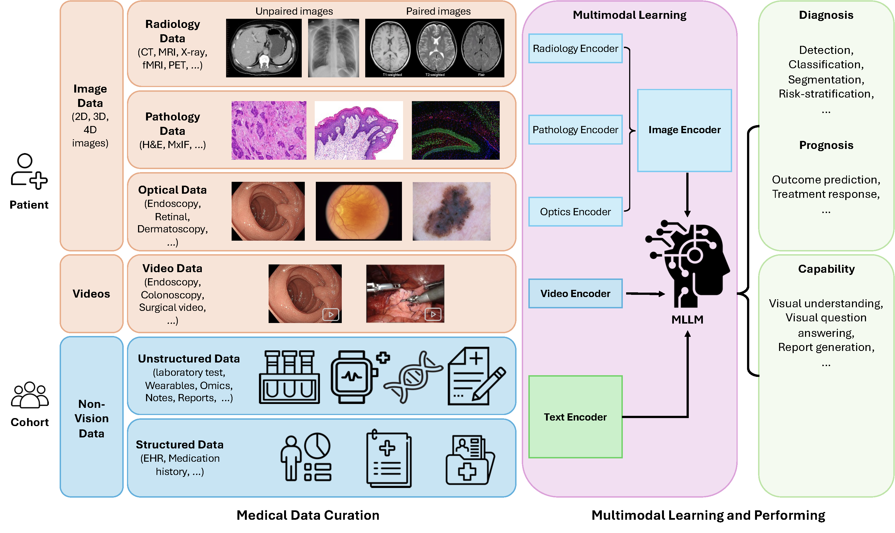

<div align="center">
  
</div>

<div align="center">
  <h1>Biomedical Multimodal Large Language Models</h1>
</div>

<div align="center">

A curated and actively maintained resource hub for  
**Biomedical Multimodal Large Language Models (MLLM4BioMed)**

[📄 Survey Paper](https://www.techrxiv.org/users/1032090/articles/1391925-multimodal-large-language-models-in-biomedicine-and-healthcare) •
[📚 Methods](#methods) •
[🧪 Datasets](#datasets) •
[💼 Commercial Models](#commercial-models) •
[🧾 Citation](#citation)

</div>

---

# Overview

This repository provides a continuously updated collection of resources for **Biomedical Multimodal Large Language Models (BioMed-MLLMs)**, including:

- biomedical multimodal models
- public datasets
- commercial multimodal models
- survey references and organized links

The repository is built based on our survey paper:

**Multimodal Large Language Models in Biomedicine and Healthcare**

<div align="center">
  
</div>

This repository aims to serve as a **centralized reference hub** for researchers working on:

- biomedical vision-language models
- multimodal foundation models in healthcare
- medical multimodal datasets
- large multimodal models for clinical AI

---

## Repository Statistics

| Resource | Count |
|---|---|
| Biomedical MLLM Models |  |
| Biomedical Datasets |  |
| Commercial Models |  |

---

# Update News

- **2026-05-21** — Added **audio, ehr MLLM** methods and datasets
- **2026-05-20** — Updated the new version of **MLLM4BioMed**
- **2025-11-11** — Updated the 1st version of **MLLM4BioMed**
- **2025-09-18** — Released this repository for collecting and organizing BioMed-MLLM resources

More updates:  
👉 [docs/updates.md](docs/updates.md)

---

# Methods

Biomedical multimodal models are categorized according to **application domain**.

## Image-based Biomedical Models

| Category | Link |
|---|---|
| Radiology LLMs | [docs/methods/radiology.md](docs/methods/radiology.md) |
| Ultrasound LLMs | [docs/methods/ultrasound.md](docs/methods/ultrasound.md) |
| Pathology LLMs | [docs/methods/pathology.md](docs/methods/pathology.md) |
| Ophthalmology LLMs | [docs/methods/ophthalmology.md](docs/methods/ophthalmology.md) |
| Endoscopy & Surgical LLMs | [docs/methods/endoscopy.md](docs/methods/endoscopy.md) |
| Dermatology LLMs | [docs/methods/dermatology.md](docs/methods/dermatology.md) |
| Multidomain LLMs | [docs/methods/multidomain.md](docs/methods/multidomain.md) |

## Electronic Health Record Models

| Category | Link |
|---|---|
| EHR-LLMs | [docs/methods/ehr.md](docs/methods/ehr.md) |

## Medical Audio Models

| Category | Link |
|---|---|
| Audio-LLMs | [docs/methods/audio.md](docs/methods/audio.md) |

## Omics Models

| Category | Link |
|---|---|
| Omics-LLMs | [docs/methods/omics.md](docs/methods/omics.md) |

## Generalist Biomedical Models

| Category | Link |
|---|---|
| Generalist Models | [docs/methods/generalist.md](docs/methods/generalist.md) |

These models include both:

- domain-specific medical models
- cross-domain biomedical multimodal foundation models

---

# Datasets

We curate datasets commonly used for **training and evaluating biomedical multimodal models**.

| Category | Link |
|---|---|
| Radiology Datasets | [docs/datasets/radiology.md](docs/datasets/radiology.md) |
| Ultrasound Datasets | [docs/datasets/ultrasound.md](docs/datasets/ultrasound.md) |
| Histopathology Datasets | [docs/datasets/histopathology.md](docs/datasets/histopathology.md) |
| Ophthalmology Datasets | [docs/datasets/ophthalmology.md](docs/datasets/ophthalmology.md) |
| Endoscopy Datasets | [docs/datasets/endoscopy.md](docs/datasets/endoscopy.md) |
| Dermatology Datasets | [docs/datasets/dermatology.md](docs/datasets/dermatology.md) |
| Electronic Health Record Datasets | [docs/datasets/ehr.md](docs/datasets/ehr.md) |
| Medical Audio Datasets | [docs/datasets/audio.md](docs/datasets/audio.md) |
| Omics Datasets | [docs/datasets/omics.md](docs/datasets/omics.md) |
| Multimodal Biomedical Datasets | [docs/datasets/multimodal.md](docs/datasets/multimodal.md) |

These datasets cover tasks such as:

- classification
- detection
- segmentation
- report generation
- captioning
- visual question answering (VQA)

---

# Commercial Models

We also summarize major **commercial and foundation multimodal models** used in biomedical research benchmarks.

| Category | Link |
|---|---|
| For-Profit / Commercial MLLMs | [docs/commercial.md](docs/commercial.md) |

These models include systems from:

- OpenAI
- Google
- Anthropic
- xAI
- Amazon
- Meta
- Alibaba
- Microsoft

---

# Contributing

We welcome contributions from the community.

Please see:

👉 **[docs/contributing.md](docs/contributing.md)**

Suggested contribution types:

- add a newly released model
- add a new biomedical multimodal dataset
- correct outdated links
- update venue / publication status
- refine categorization across domains

---

# Citation

If you find this repository useful, please cite our survey:

```bibtex
@article{gu2026multimodal,
  title={Multimodal Large Language Models in Biomedicine and Healthcare},
  author={Gu, Ran and Hou, Benjamin and Fang, Yin and He, Lauren and Zhu, Qingqing and Lu, Zhiyong},
  journal={Authorea Preprints},
  year={2026},
  publisher={Authorea}
}
```

---

# Acknowledgement 
Maintained by [BioNLP Group](https://www.ncbi.nlm.nih.gov/research/bionlp/), [Division of Intramural Research](https://www.nlm.nih.gov/research/index.html), [National Library of Medicine](https://www.nlm.nih.gov/), [National Institutes of Health](https://www.nih.gov/).

---

## ⭐ GitHub Star History

[](https://star-history.com/#ncbi-nlp/MLLM4BioMed&Date)
