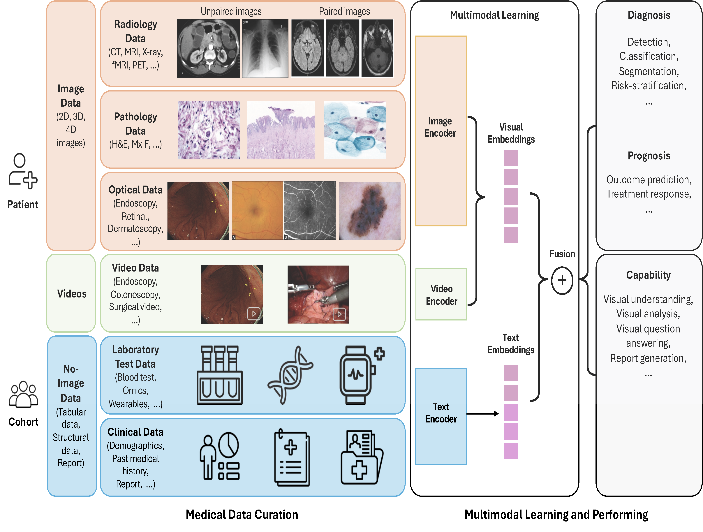

<div align="center">
  
</div>


# <div align="center"> Biomedical Multimodal Large Language Models

<div align="center">

A curated and actively maintained resource hub for  
**Biomedical Multimodal Large Language Models (MLLM4BioMed)**

[📄 Survey Paper](https://www.techrxiv.org/users/1032090/articles/1391925-multimodal-large-language-models-in-biomedicine-and-healthcare) •
[📚 Methods](#methods) •
[🧪 Datasets](#datasets) •
[💼 Commercial Models](#commercial-models) •
[🧾 Citation](#citation)

</div>

---

## Overview

This repository provides a continuously updated collection of resources for **Biomedical Multimodal Large Language Models (BioMed-MLLMs)**, including:

- biomedical multimodal models
- public datasets
- commercial multimodal models
- survey references and organized links

It is based on our survey paper:

**Multimodal Large Language Models in Biomedicine and Healthcare**

<div align="center">
  
</div>

---

## Update News

- **2025-11-11** — Updated the 1st version of **MLLM4BioMed**
- **2025-09-18** — Released this repository for collecting and organizing BioMed-MLLM resources

More updates: [docs/updates.md](docs/updates.md)

---

## Methods

### Image-LLMs

| Category | Link |
|---|---|
| Radiology LLMs | [docs/methods/radiology.md](docs/methods/radiology.md) |
| Pathology LLMs | [docs/methods/pathology.md](docs/methods/pathology.md) |
| Ophthalmology LLMs | [docs/methods/ophthalmology.md](docs/methods/ophthalmology.md) |
| Endoscopy & Surgical LLMs | [docs/methods/endoscopy.md](docs/methods/endoscopy.md) |
| Dermatology LLMs | [docs/methods/dermatology.md](docs/methods/dermatology.md) |
| Multidomain LLMs | [docs/methods/multidomain.md](docs/methods/multidomain.md) |

### Omics-LLMs

| Category | Link |
|---|---|
| Omics-LLMs | [docs/methods/omics.md](docs/methods/omics.md) |

### Generalist Models

| Category | Link |
|---|---|
| Generalist Models | [docs/methods/generalist.md](docs/methods/generalist.md) |

---

## Datasets

| Category | Link |
|---|---|
| Radiology Datasets | [docs/datasets/radiology.md](docs/datasets/radiology.md) |
| Histopathology Datasets | [docs/datasets/histopathology.md](docs/datasets/histopathology.md) |
| Ophthalmology Datasets | [docs/datasets/ophthalmology.md](docs/datasets/ophthalmology.md) |
| Endoscopy Datasets | [docs/datasets/endoscopy.md](docs/datasets/endoscopy.md) |
| Omics Datasets | [docs/datasets/omics.md](docs/datasets/omics.md) |
| Multimodal Datasets | [docs/datasets/multimodal.md](docs/datasets/multimodal.md) |

---

## Commercial Models

| Category | Link |
|---|---|
| For-Profit / Commercial MLLMs | [docs/commercial.md](docs/commercial.md) |

---

## Contributing

We welcome updates and corrections from the community.

Please see: [docs/contributing.md](docs/contributing.md)

Suggested contribution types:

- add a newly released model
- add a new biomedical multimodal dataset
- correct outdated links
- update venue / publication status
- refine categorization across domains

---

## Citation

If you use this repository, please cite:

```bibtex
@article{gu2026multimodal,
  title={Multimodal Large Language Models in Biomedicine and Healthcare},
  author={Gu, Ran and Hou, Benjamin and Fang, Yin and He, Lauren and Zhu, Qingqing and Lu, Zhiyong},
  journal={Authorea Preprints},
  year={2026},
  publisher={Authorea}
}
```

---

## Acknowledgement

Maintained by [BioNLP Group](https://www.ncbi.nlm.nih.gov/research/bionlp/), [Division of Intramural Research](https://www.nlm.nih.gov/research/index.html), [National Library of Medicine](https://www.nlm.nih.gov/), [National Institutes of Health](https://www.nih.gov/).